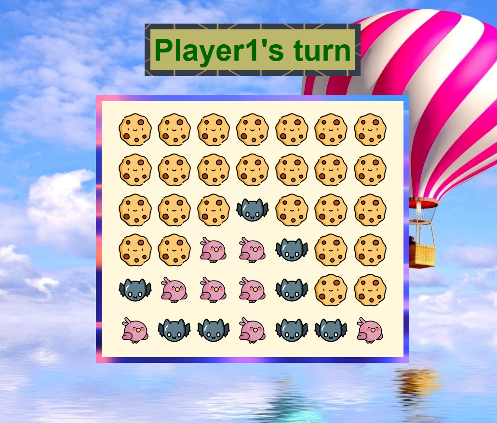

# Connect4

A simple game of Connect 4

    

## Description

Connect-Four is a tic-tac-toe-like two-player game in which players alternately place pieces on a vertical board 7 columns across and 6 rows high, and the first player to achieve a line of four connected pieces wins the game.

## Install

1. Clone this repo
2. `npm i` to install dependancies
3. `npm start` to run the server
4. Open "localhost:3000" in your browser
5. Enjoy :\)

## Technologies

- React used to create interface and game loop.
- Express server used to staticly serve the page
- Node.js used to maintain JavaScript packages.

## Key Files

1. [client/app](https://github.com/RamiOkkeh/Connect4/blob/main/client/app.jsx)
   - Creates game interface.
   - Defines responses for user events
   - Component state keeps track of game progress.
2. [client/components/Square](https://github.com/RamiOkkeh/Connect4/blob/main/client/components/Square.jsx)
   - Defines the properties of each square

## Deployed Link: [Connect4](http://c0nnect-4.herokuapp.com/public/)
